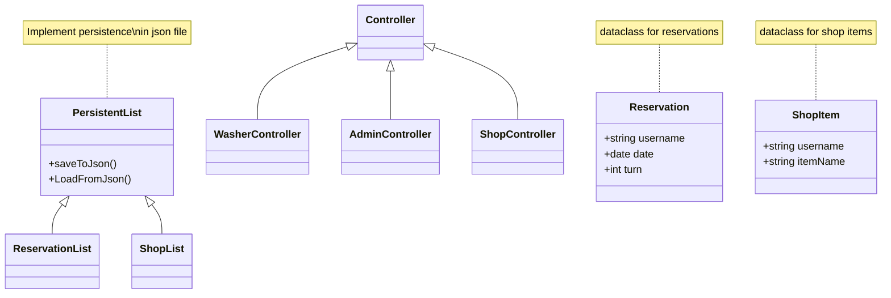
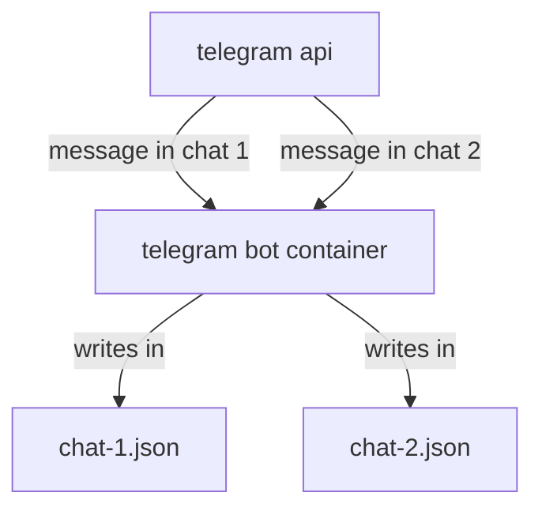

# Curiel telegram bot

This is a telegram bot for management of common resources inside the home to avoid loosing time and keep track of food storage and washing machine usage, it's one of my best effort project cause i don't have time for this :(

## Features

The bot main features are shop list management and washer reservations

### Management of shop list

The bot manages a shop list of items to buy, the commands are as follows:

- `/manca <item>` - add item to the shopping list
- `/preso <item>` - remove item from the shopping list
- `/mancanze` -  print shopping list


### Washier reservations

The bot manages also washer reservations, the commands are as follows:

- `/lavatrice` - get washing machine's reservation for the next 7 days
- `/prenota <day> <turn>` - make reservation for the washing machine at a specific turn of a day
- `/libera` - delete washing machine reservation #TODO
- `/turni` - get washing machine's turn schedule

### Admin commands

There are also admin commands for management of the bot:

- `/admin` - check if current user is the admin bot

## Installation

Installation is done trough the docker image, requirements are as follows

- a telegram bot account and token
- a telegram user that will be the admin of the bot (*can run admin commands*)

using docker compose:

```yaml
services:
  curiel_bot:
    image: carnivuth/curiel_bot:latest
    restart: unless-stopped
    environment:
      TOKEN: "<INSERT TOKEN HERE>"
      ADMIN: "<TELEGRAM USERNAME OF ADMIN USER>"
    volumes:
      - '<PATH TO DATA FOLDER ON DISK>:/var/lib/curiel_bot/'
```

## Development documentation

>[!WARNING] This documentation is for development only!!!

The bot is developed using [node.js](https://nodejs.org/) and [telegram-bot-api](https://www.npmjs.com/package/node-telegram-bot-api) library

## domain model


## runtime architecture

At runtime the bot pull messages and process requests based on chat id, different chats can share the bot instance and data are stored based in `chatId` parameter



## development environment

